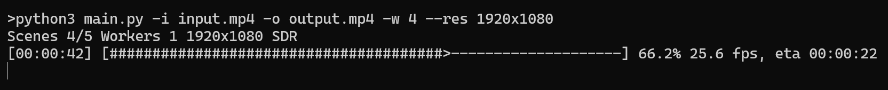

WIP av1an-style chunked encoding with python, requires ffmpeg.



Do not use for production. Currently very limited.

## Usage

Example with 4 workers, automatic cropping and 1080p resolution

```sh
   python3 main.py -i "input.mp4" -o "output.mp4" -w 4 --autocrop --res 1920x1080
   ```

