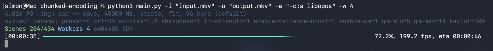

WIP chunked encoding with Python using FFmpeg.



Do not use for production. Currently very limited.

This is a mostly a fun side project born out of curiosity.
I wanted to make an av1an-style chunked encoding tool with different design decisions and experiment with new ideas that aren't implemented in av1an.

These include psy-oriented defaults for SVT-AV1, better defaults in general,
a rolling scenecut implementation with parallel encoding instead of a bottlenecked two-step approach,
strictly FFmpeg-based processing with no other dependencies, and various minor QoL improvements.

Performance is better too, usually beating av1an.

|   | total time | file size | XPSNR-Y |
| ------------- | ------------- | ----- | ---- |
| av1an  | 1:05:18.57  | 1,004,773,655 B | 39.7786 |
| chunked-encoding  | 41:34.06 | 1,004,331,197 B | 39.7699 |

Big Buck Bunny 1080p looped 5x (70 minutes), Apple M3 Pro

<details>

<summary>Commands</summary>

### Execution

`time av1an -i bbb_70m.mp4 -o bbb_70m-av1an.mkv -w 2 -a "-c:a libopus -b:a 256k -mapping_family 1 -sn" -v "--preset 4 --crf 35 --ac-bias 1.0 --sharpness 1 --tf-strength 1 --enable-variance-boost 1 --enable-qm 1 --qm-min 5 --qm-max 10 --keyint 300"`

`time python3 main.py -i bbb_70m.mp4 -o bbb_70m-ce.mkv -w 2 -a "-c:a libopus -b:a 256k -mapping_family 1" -v "--preset 4 --crf 35 --ac-bias 1.0 --sharpness 1 --tf-strength 1 --enable-variance-boost 1 --enable-qm 1 --qm-min 5 --qm-max 10 --keyint 300"`

### XPSNR

`ffmpeg -i bbb_70m.mp4 -colorspace bt709 -color_primaries bt709 -color_trc bt709 -i bbb_70m-av1an.mkv -lavfi \                                                            
"[0:v]settb=AVTB,setpts=PTS-STARTPTS,format=yuv420p10le[ref]; \ 
 [1:v]settb=AVTB,setpts=PTS-STARTPTS,format=yuv420p10le[main]; \                   
 [main][ref]xpsnr=stats_file=xpsnr_av1an.log:ts_sync_mode=nearest" -an -f null -`

`ffmpeg -i bbb_70m.mp4 -i bbb_70m-ce.mkv -lavfi \
"[0:v]settb=AVTB,setpts=PTS-STARTPTS,format=yuv420p10le[ref]; \
 [1:v]settb=AVTB,setpts=PTS-STARTPTS,format=yuv420p10le[main]; \
 [main][ref]xpsnr=stats_file=xpsnr_ce.log:ts_sync_mode=nearest" -t 60 -an -f null -`
</details>

## Usage

- `-i` `-o`

File input and output.

- `-v` 

Video encoder options. Uses SVT-AV1-HDR default parameters for psy features that were merged into mainline, which can be removed by specifying "reset-all".

- `-a` 

Audio mapping options. Maps highest channel count audio first, uses ffmpeg syntax.
Supports auto bit rate when specifying libopus with "-c:a libopus"

- `-w` 

Worker count. Currently defaults to 1.

Chunked-encoding currently does not copy or support mapping for subtitle streams.

- `--low_power`
Use background task policy for workers on macOS.
- `--disable-ten-bit`
Disable 10 bit encoding.
- `--disable-hwaccel`
Disable hardware accelerated decoding.
- `--autocrop`
Automatically crop input video.
- `--res WxH`
Resolution limit for video. Preserves aspect ratio and scales by longest axis. 

Example with 4 workers, automatic cropping and 1080p resolution

```sh
   python3 main.py -i "input.mp4" -o "output.mp4" -w 4 --autocrop --res 1920x1080
   ```

